# Odin - AI Trading Companion

> An intelligent trading platform powered by multi-agent AI systems, real-time market analysis, and pattern recognition.


## 🎯 Overview

Odin is an advanced AI-powered trading companion that combines multi-agent analysis, autonomous trading capabilities, real-time market monitoring, and intelligent pattern recognition to help you make informed trading decisions. The platform learns from your trading history and proactively alerts you when similar market conditions arise.

## 🏗️ Architecture

```
┌─────────────────────────────────────────────────────────────┐
│                      Frontend (Next.js)                      │
│  ┌──────────┐  ┌──────────┐  ┌──────────┐  ┌──────────┐   │
│  │ Analysis │  │AutoTrade │  │   Trade  │  │  Alerts  │   │
│  │   Tab    │  │   Tab    │  │   Tab    │  │   Tab    │   │
│  └──────────┘  └──────────┘  └──────────┘  └──────────┘   │
└─────────────────────────────────────────────────────────────┘
                            │
                    WebSocket + REST API
                            │
┌─────────────────────────────────────────────────────────────┐
│                    Backend (FastAPI)                         │
│  ┌──────────────┐  ┌──────────────┐  ┌──────────────┐     │
│  │ Multi-Agent  │  │  Autonomous  │  │   Sentinel   │     │
│  │   Analysis   │  │    Trading   │  │    Alerts    │     │
│  └──────────────┘  └──────────────┘  └──────────────┘     │
│                                                              │
│  ┌──────────────┐  ┌──────────────┐  ┌──────────────┐     │
│  │   Alpaca     │  │   ChromaDB   │  │  PostgreSQL  │     │
│  │     API      │  │   (Memory)   │  │  (Database)  │     │
│  └──────────────┘  └──────────────┘  └──────────────┘     │
└─────────────────────────────────────────────────────────────┘
```

---

## 📊 1. Analysis Section

### What It Does

The Analysis section runs a **multi-agent AI framework** that simulates a team of financial experts analyzing a stock from different perspectives. Think of it as having a team of analysts, traders, and risk managers all working together to give you a comprehensive trading recommendation.

### How It Works

#### Multi-Agent System

The system uses **7 specialized AI agents** that collaborate in a structured workflow:


#### The Agents

1. **Market Analyst** 📈
   - Analyzes technical indicators (RSI, MACD, Moving Averages)
   - Identifies support/resistance levels
   - Evaluates price trends and patterns

2. **Fundamentals Analyst** 💼
   - Reviews financial statements (P/E ratio, EPS, revenue growth)
   - Assesses company health and valuation
   - Compares metrics to industry standards

3. **News Analyst** 📰
   - Scans recent news and press releases
   - Analyzes insider trading activity
   - Identifies market-moving events

4. **Social Media Analyst** 🐦
   - Monitors Reddit (r/wallstreetbets, r/stocks)
   - Tracks Twitter sentiment
   - Gauges retail investor interest

5. **Bull vs Bear Debate** ⚖️
   - Bull agent argues for buying
   - Bear agent argues for selling
   - Structured debate to explore both sides

6. **Trader** 💰
   - Makes initial trading decision
   - Considers all analyst inputs
   - Proposes position size and entry/exit points

7. **Risk Manager** 🛡️
   - Reviews trader's decision
   - Validates risk/reward ratio
   - Sets stop-loss and take-profit levels
   - Makes final BUY/HOLD/SELL recommendation

#### Technical Implementation

**Backend:** [`backend/app/services/analysis_service.py`](backend/app/services/analysis_service.py)

```python
# The analysis service orchestrates all agents
service = AnalysisService(db)
result = await service.run_analysis(
    ticker="AAPL",
    date="2024-01-15",
    analysts=["market", "fundamentals", "news", "social"]
)
```

**API Endpoint:** `POST /analysis/run`

**Response Structure:**
```json
{
  "ticker": "AAPL",
  "date": "2024-01-15",
  "final_decision": "BUY",
  "confidence": 0.85,
  "market_analysis": { ... },
  "fundamentals_analysis": { ... },
  "news_analysis": { ... },
  "social_analysis": { ... },
  "bull_bear_debate": { ... },
  "trader_decision": { ... },
  "risk_management": {
    "stop_loss": 175.50,
    "take_profit": 195.00,
    "position_size": 10
  }
}
```

### Key Features

- ✅ **Comprehensive Analysis** - Multiple perspectives in one report
- ✅ **Real-time Data** - Live market data from Alpaca API
- ✅ **Historical Tracking** - View past analysis results
- ✅ **Batch Processing** - Analyze multiple stocks simultaneously
- ✅ **LLM-Powered** - Uses GPT-4 for intelligent reasoning

### Usage

1. Navigate to the **Analysis** tab
2. Enter a stock ticker (e.g., AAPL, TSLA, NVDA)
3. Click "Run Analysis"
4. Wait 30-60 seconds for the multi-agent system to complete
5. Review the comprehensive report with final recommendation

---

## 🤖 2. Auto Trade Section

### What It Does

The Auto Trade section enables **fully autonomous trading** where the system continuously monitors the market, identifies opportunities, executes trades, and manages positions automatically - all without human intervention.

### How It Works

#### Three-Stage Pipeline


#### Stage 1: Signal Gathering (Every 5 minutes)

The system collects trading signals from multiple sources:

**Sources:**
- 📰 **News** - Breaking financial news via DuckDuckGo search
- 🐦 **Reddit** - Posts from r/wallstreetbets, r/stocks
- 📊 **Technical** - Price movements, volume spikes
- 💬 **Social Media** - Twitter mentions and sentiment

**Signal Processing:**
```python
# Each signal is scored and stored
signal = Signal(
    symbol="AAPL",
    source="reddit",
    sentiment=0.85,  # -1 to 1
    volume=1500,     # Number of mentions
    reason="Apple earnings beat expectations"
)
```

#### Stage 2: Analysis & Execution (Every 15 minutes)

1. **Rank Signals** - Top signals by sentiment × volume
2. **Run Analysis** - Use multi-agent system on top 3 signals
3. **Execute Trades** - If recommendation is BUY and confidence > 70%
4. **Risk Checks** - Validate against budget and position limits

**Guardrails:**
- Maximum positions: 5 concurrent stocks
- Per-trade budget: $1,000 default
- Total portfolio limit: $10,000 default
- Minimum confidence: 70%

#### Stage 3: Position Monitoring (Every 5 minutes)

Continuously monitors open positions and automatically:

- **Take Profit** - Sell when profit target reached (default: +10%)
- **Stop Loss** - Sell when loss limit hit (default: -5%)
- **Update Status** - Track P&L in real-time

**Example:**
```
Position: AAPL
Entry: $175.00 (10 shares)
Current: $192.50
P&L: +$175.00 (+10%)
Action: TAKE PROFIT TRIGGERED → Sell 10 shares
```

#### Technical Implementation

**Backend:** [`backend/app/services/autonomous_service.py`](backend/app/services/autonomous_service.py)

**Background Jobs:**
```python
# Scheduled tasks
@scheduler.scheduled_job('interval', minutes=5)
async def gather_signals():
    # Collect signals from all sources
    
@scheduler.scheduled_job('interval', minutes=15)
async def run_analysis():
    # Analyze top signals and execute trades
    
@scheduler.scheduled_job('interval', minutes=5)
async def monitor_positions():
    # Check P&L and execute take-profit/stop-loss
```

**API Endpoints:**
- `POST /autonomous/enable` - Start autonomous trading
- `POST /autonomous/disable` - Stop autonomous trading
- `POST /autonomous/emergency-stop` - Emergency shutdown
- `GET /autonomous/status` - Current status and metrics
- `PUT /autonomous/config` - Update trading parameters

### Configuration

```json
{
  "enabled": true,
  "max_positions": 5,
  "per_trade_budget": 1000,
  "total_budget": 10000,
  "min_confidence": 0.7,
  "take_profit_pct": 0.10,
  "stop_loss_pct": 0.05,
  "allowed_symbols": ["AAPL", "TSLA", "NVDA", "MSFT", "GOOGL"]
}
```

### Key Features

- ✅ **Fully Automated** - No manual intervention required
- ✅ **Multi-Source Signals** - News, Reddit, technical indicators
- ✅ **Risk Management** - Automatic stop-loss and take-profit
- ✅ **Position Limits** - Prevents over-exposure
- ✅ **Real-time Monitoring** - Live P&L tracking
- ✅ **Emergency Stop** - Instant shutdown capability

### Usage

1. Navigate to the **Auto Trade** tab
2. Configure your trading parameters (budget, limits, etc.)
3. Click "Enable Auto Trading"
4. Monitor the dashboard for:
   - Active signals
   - Open positions
   - Trade history
   - Performance metrics
5. Click "Disable" or "Emergency Stop" to halt trading

---

## 💹 3. Trade Page

### What It Does

The Trade Page provides a **manual trading interface** with real-time market data, live price updates via WebSocket, and intelligent context tracking. Every trade you make is enriched with market conditions, news, and sentiment data for future analysis.

### How It Works

#### Real-time Market Data (WebSocket)


**Implementation:** [`frontend/src/hooks/useMarketWebSocket.ts`](frontend/src/hooks/useMarketWebSocket.ts)

```typescript
// Subscribe to real-time prices
const { prices, subscribe, unsubscribe } = useMarketWebSocket();

subscribe("AAPL");
// Prices update automatically
console.log(prices["AAPL"]); // { price: 175.50, change: +2.5% }
```

#### Trade Execution Flow


#### Market Context Enrichment

Every trade is automatically enriched with:

1. **News Context** 📰
   - Latest news from DuckDuckGo search
   - LLM-summarized headlines
   - Example: "Apple Q4 earnings beat expectations"

2. **Sentiment Score** 📊
   - Aggregated from recent signals
   - Range: -1 (very bearish) to +1 (very bullish)
   - Example: 0.85 (bullish)

3. **Technical Context** 🔧
   - How the trade was executed
   - Example: "Manual buy via Trade Panel"

4. **Metadata** 📋
   - Alpaca order ID
   - Estimated price
   - Timestamp

**Database Record:**
```json
{
  "id": 12,
  "symbol": "AAPL",
  "side": "buy",
  "quantity": 10,
  "price_at_action": 175.50,
  "sentiment_score": 0.85,
  "news_context": "Apple announces new iPhone 16 with AI features",
  "technical_context": "Manual buy via Trade Panel",
  "timestamp": "2024-01-15T14:30:00Z",
  "outcome": "Profit: +$175.00 (+10%)"
}
```

#### Components

**Popular Stocks** 📈
- Pre-selected watchlist (AAPL, TSLA, NVDA, etc.)
- Real-time price updates
- Quick-select for trading

**Stock Detail** 🔍
- Current price and change
- 24h high/low
- Volume
- Market cap

**Trading Panel** 💰
- Buy/Sell tabs
- Quantity input
- Estimated cost
- One-click execution

**Portfolio Summary** 💼
- Total value
- Cash balance
- Today's P&L
- Total P&L

**Positions List** 📊
- Open positions
- Current P&L per position
- Quick close buttons

### Technical Implementation

**Backend:** [`backend/app/api/positions.py`](backend/app/api/positions.py)

**API Endpoints:**
- `POST /trades/execute` - Execute a trade
- `GET /positions` - Get open positions
- `POST /positions/{symbol}/close` - Close a position
- `GET /trades/history` - Trade history

**WebSocket:** [`backend/app/api/websocket.py`](backend/app/api/websocket.py)
- `ws://localhost:8000/ws/market` - Real-time price stream

### Key Features

- ✅ **Real-time Prices** - WebSocket updates every second
- ✅ **One-Click Trading** - Fast execution
- ✅ **Context Tracking** - Every trade enriched with market data
- ✅ **Portfolio Management** - Track positions and P&L
- ✅ **Market Hours** - Automatic validation
- ✅ **Crypto Support** - 24/7 trading for crypto assets

### Usage

1. Navigate to the **Trade** tab
2. Select a stock from Popular Stocks or search
3. View real-time price and details
4. Choose Buy or Sell
5. Enter quantity
6. Click "Buy" or "Sell"
7. Confirm the trade
8. View in Positions List

---

## 🔔 4. Alert System (Sentinel)

### What It Does

The Sentinel Alert System is your **AI-powered trading guardian** that learns from your trading history and proactively warns you when similar market conditions arise. It uses **vector embeddings** and **pattern matching** to find situations where you've traded before and tells you how those trades turned out.

### How It Works

#### Pattern Recognition Pipeline

```mermaid
graph TD
    A[New Market Signal] --> B[Generate Embedding]
    B --> C[Search ChromaDB Memory]
    C --> D{Similarity > 35%?}
    D -->|Yes| E[Fetch Past Trade Details]
    D -->|No| F[No Alert]
    E --> G[Classify Alert Type]
    G --> H{Past Outcome?}
    H -->|Profit| I[🟢 Opportunity Alert]
    H -->|Loss| J[🔴 Risk Warning]
    H -->|Unknown| K[🔵 Pattern Match]
    I --> L[Send Alert to Frontend]
    J --> L
    K --> L
```



#### Step-by-Step Process

**1. Learning Phase (Automatic)**

Every time you make a trade, the system:
- Stores the trade details in the database
- Creates a vector embedding of the market context
- Saves it to ChromaDB memory

```python
# Example: You bought AAPL during earnings
activity = UserActivity(
    symbol="AAPL",
    side="buy",
    quantity=10,
    news_context="Apple Q4 earnings beat expectations",
    outcome="Loss: -$87.50 (-5%)"  # Filled later when position closes
)

# Embedding stored in ChromaDB
memory.add_activity(
    activity_text="News about AAPL: Apple Q4 earnings beat expectations",
    metadata={"activity_id": 12, "outcome": "Loss: -$87.50 (-5%)"}
)
```

**2. Monitoring Phase (Continuous)**

The system continuously monitors for new market signals:
- News articles
- Reddit posts
- Social media mentions
- Technical indicators

**3. Matching Phase (Real-time)**

When a new signal arrives:

```python
# New signal: "Apple Q1 earnings report scheduled"
signal = Signal(
    symbol="AAPL",
    source="news",
    reason="Apple Q1 earnings report scheduled for next week"
)

# Search for similar past situations
matches = memory.find_similar_situations(
    "News about AAPL: Apple Q1 earnings report scheduled",
    n_matches=3
)

# If similarity > 35%, generate alert
if matches[0]["similarity_score"] > 0.35:
    create_alert(signal, matches[0])
```

**4. Alert Generation**

The system creates a rich, actionable alert:

```
📰 News Event: "Apple Q1 earnings report scheduled for next week"

⚠️ Similar Situation Detected (85% match)

Last time during similar news:
• You bought 10 shares at $175.50
• Result: Loss: -$87.50 (-5%)

💡 Warning: This pattern previously led to a loss. Review carefully.
```

#### Alert Classification

Alerts are automatically classified based on past outcomes:

| Past Outcome | Alert Type | Color | Icon |
|--------------|------------|-------|------|
| Profit (+$) | Opportunity | 🟢 Green | TrendingUp |
| Loss (-$) | Risk Warning | 🔴 Red | AlertTriangle |
| Unknown | Pattern Match | 🔵 Blue | Info |

#### Technical Implementation

**Backend:** [`backend/app/services/sentinel_service.py`](backend/app/services/sentinel_service.py)

```python
class SentinelService:
    async def process_signal(self, signal: Signal):
        # 1. Search memory for similar situations
        matches = self.memory.find_similar_situations(
            f"News about {signal.symbol}: {signal.reason}",
            n_matches=3
        )
        
        # 2. Check similarity threshold
        if matches[0]["similarity_score"] < 0.35:
            return None
        
        # 3. Fetch past trade details
        activity = await self.db.get(UserActivity, activity_id)
        
        # 4. Classify alert type
        if "profit" in activity.outcome.lower():
            alert_type = "opportunity"
        elif "loss" in activity.outcome.lower():
            alert_type = "risk_warning"
        else:
            alert_type = "pattern_match"
        
        # 5. Create alert
        alert = Alert(
            title=f"Similar Pattern: {signal.symbol}",
            message=self._build_message(signal, activity),
            alert_type=alert_type,
            similarity_score=matches[0]["similarity_score"]
        )
        
        return alert
```

**Memory Service:** [`backend/app/services/memory_service.py`](backend/app/services/memory_service.py)

Uses **ChromaDB** for vector similarity search:
- Embeddings: OpenAI `text-embedding-3-small`
- Similarity: Cosine similarity
- Threshold: 35% minimum match

**API Endpoints:**
- `GET /sentinel/alerts` - Get all alerts
- `POST /sentinel/alerts/{id}/read` - Mark alert as read

### Alert Types & Examples

#### 🟢 Opportunity Alert

```
📰 News Event: "NVIDIA rumored to announce new AI chip at GTC"

✨ Opportunity Detected (88% match)

Last time during similar news:
• You bought 5 shares at $485.00
• Result: Profit: +$364.50 (+15%)

💡 This pattern previously led to a profit. Similar opportunity detected.
```

#### 🔴 Risk Warning

```
📰 News Event: "Tesla reports production delays at Gigafactory"

⚠️ Risk Warning (92% match)

Last time during similar news:
• You bought 12 shares at $238.50
• Result: Loss: -$286.20 (-10%)

💡 Warning: This pattern previously led to a loss. Review carefully.
```

#### 🔵 Pattern Match

```
📰 News Event: "Microsoft Azure shows strong growth in cloud market"

🔍 Similar Pattern Detected (78% match)

Last time during similar news:
• You bought 20 shares at $378.00
• Result: Position still open

💡 Consider reviewing this pattern before trading.
```

### Frontend Features

**Filter Tabs:**
- **All** - View all alerts
- **Unread** - Only new alerts
- **History** 🆕 - Past alerts you've read
- **Risks** - Risk warnings only
- **Opportunities** - Opportunity alerts only
- **Info** - Pattern matches

**Alert Card:**
- Alert type icon and color
- News event that triggered it
- Similarity score badge
- Past trade details
- Profit/loss outcome
- Timestamp
- Mark as read button

### Key Features

- ✅ **Pattern Learning** - Learns from every trade
- ✅ **Proactive Alerts** - Warns before you trade
- ✅ **Rich Context** - Shows exact past situation
- ✅ **Profit/Loss History** - See how similar trades performed
- ✅ **Smart Classification** - Auto-categorizes as risk/opportunity
- ✅ **Real-time Monitoring** - Continuous signal processing
- ✅ **Vector Search** - Fast similarity matching with ChromaDB

### Usage

1. **Make Trades** - System learns automatically
2. **Wait for Alerts** - Sentinel monitors 24/7
3. **Review Alerts** - Check the Alerts tab
4. **Filter by Type** - Use tabs to focus on risks or opportunities
5. **View History** - See past alerts in History tab
6. **Make Informed Decisions** - Trade with confidence

### Demo Data

For hackathon/demo purposes, generate realistic mock data:

```bash
cd backend
uv run python scripts/generate_demo_data.py
```

This creates:
- 12 past trades with various outcomes
- 5 trigger signals
- 4 alerts (2 opportunities, 2 risk warnings)

See [`backend/scripts/DEMO_DATA_README.md`](backend/scripts/DEMO_DATA_README.md) for details.

---

## 🚀 Getting Started

### Prerequisites

- **Python 3.10+**
- **Node.js 18+**
- **PostgreSQL** (or SQLite for development)
- **Alpaca API Key** (for live trading)
- **OpenAI API Key** (for AI agents)

### Installation

#### 1. Clone the Repository

```bash
git clone https://github.com/adilzubair/Odin-AI-Trading-Companion.git
cd Odin-AI-Trading-Companion
```

#### 2. Backend Setup

```bash
cd backend

# Install dependencies with uv
uv sync

# Create .env file
cp .env.example .env

# Edit .env with your API keys
# ALPACA_API_KEY=your_key
# ALPACA_SECRET_KEY=your_secret
# OPENAI_API_KEY=your_key

# Run migrations
uv run alembic upgrade head

# Start the server
uv run uvicorn app.main:app --host 0.0.0.0 --port 8000 --reload
```

#### 3. Frontend Setup

```bash
cd frontend

# Install dependencies
npm install

# Create .env.local
cp .env.example .env.local

# Edit .env.local
# NEXT_PUBLIC_API_URL=http://localhost:8000
# NEXT_PUBLIC_API_KEY=your_api_key

# Start the dev server
npm run dev
```

#### 4. Access the Application

Open [http://localhost:3000](http://localhost:3000) in your browser.

---

## 📁 Project Structure

```
odin-ai-trading-companion/
├── backend/
│   ├── app/
│   │   ├── api/              # API endpoints
│   │   │   ├── analysis.py   # Analysis endpoints
│   │   │   ├── autonomous.py # Auto-trade endpoints
│   │   │   ├── positions.py  # Trading endpoints
│   │   │   ├── sentinel.py   # Alert endpoints
│   │   │   └── websocket.py  # WebSocket endpoints
│   │   ├── services/         # Business logic
│   │   │   ├── analysis_service.py
│   │   │   ├── autonomous_service.py
│   │   │   ├── sentinel_service.py
│   │   │   ├── memory_service.py
│   │   │   └── alpaca_service.py
│   │   ├── models/           # Database models
│   │   ├── core/             # Core utilities
│   │   └── main.py           # FastAPI app
│   ├── scripts/              # Utility scripts
│   │   └── generate_demo_data.py
│   └── tests/                # Tests
├── frontend/
│   ├── src/
│   │   ├── app/              # Next.js pages
│   │   ├── components/       # React components
│   │   │   ├── tabs/         # Main tab components
│   │   │   ├── alerts/       # Alert components
│   │   │   └── trade/        # Trading components
│   │   ├── hooks/            # Custom hooks
│   │   ├── services/         # API services
│   │   └── store/            # State management
│   └── public/               # Static assets
└── README.md                 # This file
```

---

## 🛠️ Technologies

### Backend
- **FastAPI** - Modern Python web framework
- **SQLAlchemy** - ORM for database
- **ChromaDB** - Vector database for pattern matching
- **LangChain** - LLM orchestration
- **OpenAI GPT-4** - AI agents
- **Alpaca API** - Stock trading
- **APScheduler** - Background jobs

### Frontend
- **Next.js 14** - React framework
- **TypeScript** - Type safety
- **Tailwind CSS** - Styling
- **Zustand** - State management
- **date-fns** - Date formatting
- **Lucide React** - Icons

---

## 📊 Database Schema

### Key Tables

**user_activities**
- Stores every trade with market context
- Fields: symbol, side, quantity, price, news_context, sentiment_score, outcome

**signals**
- Market signals from various sources
- Fields: symbol, source, sentiment, volume, reason

**alerts**
- Generated alerts from Sentinel
- Fields: title, message, alert_type, similarity_score, is_read

**positions**
- Open trading positions
- Fields: symbol, quantity, entry_price, current_price, pnl

**analysis_results**
- Multi-agent analysis results
- Fields: ticker, final_decision, confidence, analyst_reports

---

## 🔐 Security

- API key authentication
- Environment variable configuration
- Secure WebSocket connections
- Rate limiting on endpoints
- Input validation and sanitization

---

## 📈 Performance

- **WebSocket** - Real-time price updates (< 100ms latency)
- **ChromaDB** - Fast vector search (< 50ms for similarity queries)
- **Background Jobs** - Async processing for autonomous trading
- **Caching** - Redis for frequently accessed data
- **Database Indexing** - Optimized queries

---

## 🧪 Testing

```bash
# Backend tests
cd backend
uv run pytest

# Frontend tests
cd frontend
npm test

# E2E tests
npm run test:e2e
```

---

## 📝 License

MIT License - see [LICENSE](LICENSE) file for details.

---

## 🤝 Contributing

Contributions are welcome! Please read [CONTRIBUTING.md](CONTRIBUTING.md) for guidelines.

---

## 📧 Contact

- **GitHub**: [@adilzubair](https://github.com/adilzubair)
- **Project**: [Odin AI Trading Companion](https://github.com/adilzubair/Odin-AI-Trading-Companion)

---

## 🙏 Acknowledgments

- **Alpaca** - For providing the trading API
- **OpenAI** - For GPT-4 and embeddings
- **LangChain** - For agent orchestration
- **ChromaDB** - For vector similarity search

---

**Built with ❤️ for intelligent trading**
