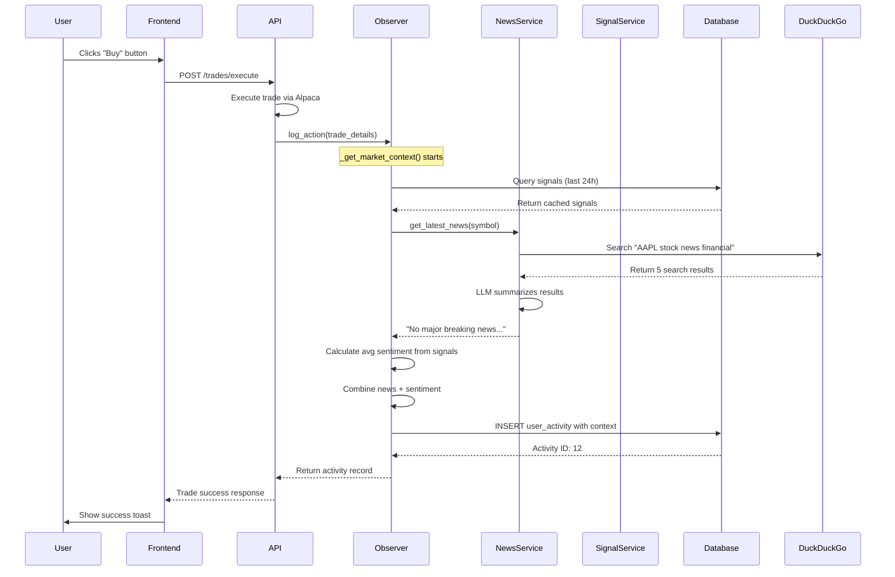

# How Market Context Fetching Works - Deep Dive

## ✅ YES, It's Stored in the Database!

Here's your actual AAPL trade from the database:

```
ID: 12
Symbol: AAPL
Activity Type: manual_trade_executed
Side: buy
Quantity: 4.0
Sentiment Score: 0.1555
News Context: "No major breaking news found in the last 24h."
Technical Context: "Manual buy via Trade Panel"
Timestamp: 2026-02-07 14:24:20
Metadata: {"alpaca_order_id": "3fb0181e-2432-42ea-b169-1be9c35aaf9b", "estimated_price": 291.04}
```

## How Market Context is Fetched - Step by Step

### The Complete Flow:



### Detailed Breakdown:

#### 1. **Frontend Triggers Trade** ([TradingPanel.tsx:52-56](file:///Users/muhamedadil/github/deriv/frontend/src/components/trade/TradingPanel.tsx#L52-L56))
```typescript
const response = await tradesService.executeTrade({
    symbol: stock.ticker,    // "AAPL"
    quantity: quantityNum,   // 4
    side: activeTab,         // "buy"
    reason: `Manual ${activeTab} via Trade Panel`
});
```

#### 2. **Backend Executes Trade** ([positions.py:95-99](file:///Users/muhamedadil/github/deriv/backend/app/api/positions.py#L95-L99))
```python
result = await alpaca.place_market_order(
    symbol=trade_request.symbol,
    quantity=trade_request.quantity,
    side=trade_request.side
)
```

#### 3. **Observer Logs Action** ([positions.py:113-120](file:///Users/muhamedadil/github/deriv/backend/app/api/positions.py#L113-L120))
```python
observer = ObserverService(db)
await observer.log_action(UserActionCreate(
    activity_type="manual_trade_executed",
    symbol=trade_request.symbol,
    side=trade_request.side,
    quantity=trade_request.quantity,
    client_context=trade_request.reason,
    meta_data={"alpaca_order_id": result.get("order_id"), ...}
))
```

#### 4. **Market Context Fetching** ([observer_service.py:79-122](file:///Users/muhamedadil/github/deriv/backend/app/services/observer_service.py#L79-L122))

This is where the magic happens:

**Step 4a: Fetch News** ([observer_service.py:100](file:///Users/muhamedadil/github/deriv/backend/app/services/observer_service.py#L100))
```python
news_summary = await self.news_service.get_latest_news(symbol)
```

**How News Fetching Works** ([news_service.py:32-80](file:///Users/muhamedadil/github/deriv/backend/app/services/news_service.py#L32-L80)):

1. **Web Search** (line 46-49):
   ```python
   with DDGS() as ddgs:
       results_gen = ddgs.text("AAPL stock news financial", max_results=5)
       results_list = list(results_gen)
   ```
   - Uses DuckDuckGo to search the web
   - Gets top 5 recent results
   - Returns actual news articles from the internet

2. **LLM Summarization** (line 62-78):
   ```python
   prompt = ChatPromptTemplate.from_template("""
       You are a financial news reporter. 
       I will provide you with search results for stock {symbol}.
       Please verify if there is any SIGNIFICANT, RECENT news (last 24h).
       
       If there is relevant news, summarize the TOP headline in 1-2 sentences. 
       If the results are generic or old, just say "No major breaking news found in the last 24h."
   """)
   
   chain = prompt | self.llm
   response = await chain.ainvoke({"symbol": symbol, "results": raw_results})
   ```
   - GPT-4 analyzes the search results
   - Filters out old/irrelevant news
   - Returns concise summary

**Step 4b: Calculate Sentiment** ([observer_service.py:87-117](file:///Users/muhamedadil/github/deriv/backend/app/services/observer_service.py#L87-L117))
```python
# Get signals from last 24 hours
result = await self.db.execute(
    select(Signal)
    .where(Signal.symbol == symbol)
    .where(Signal.timestamp >= yesterday)
    .order_by(desc(Signal.timestamp))
    .limit(5)
)
signals = result.scalars().all()

# Calculate average sentiment
avg_sentiment = sum(s.sentiment for s in signals) / len(signals)
```

Sources of sentiment signals:
- Reddit posts (r/wallstreetbets, r/stocks)
- Social media mentions
- Technical indicators
- Previous analysis results

#### 5. **Store in Database** ([observer_service.py:36-53](file:///Users/muhamedadil/github/deriv/backend/app/services/observer_service.py#L36-L53))
```python
activity = UserActivity(
    user_id=user_id,
    activity_type=action.activity_type,
    symbol=action.symbol,
    side=action.side,
    quantity=action.quantity,
    
    # Enriched Context (THE IMPORTANT PART!)
    sentiment_score=context.get("sentiment"),      # 0.1555
    news_context=context.get("news_summary"),      # "No major breaking news..."
    technical_context=action.client_context,       # "Manual buy via Trade Panel"
    meta_data=action.meta_data                     # {"alpaca_order_id": "..."}
)

self.db.add(activity)
await self.db.commit()
```

## What Gets Stored

Every trade creates a record with:

| Field | Your Trade | Purpose |
|-------|-----------|---------|
| `id` | 12 | Unique identifier |
| `symbol` | AAPL | Stock ticker |
| `activity_type` | manual_trade_executed | What happened |
| `side` | buy | Buy or sell |
| `quantity` | 4.0 | Number of shares |
| `sentiment_score` | 0.1555 | Market sentiment (-1 to 1) |
| `news_context` | "No major breaking news..." | Latest news summary |
| `technical_context` | "Manual buy via Trade Panel" | How/why trade was made |
| `timestamp` | 2026-02-07 14:24:20 | Exact time |
| `meta_data` | {"alpaca_order_id": "...", "estimated_price": 291.04} | Additional details |

## Why This Matters

The system can now:

1. **Learn Patterns**: "User tends to buy AAPL when sentiment is around 0.15"
2. **Warn About Risks**: "Last time you bought with this sentiment, the stock dropped 5%"
3. **Identify Success**: "Your best trades happen when sentiment is between 0.3-0.5"
4. **Context-Aware Recommendations**: "Similar market conditions to your profitable NVDA trade"

## Verification

You can verify this yourself:

```bash
# Check your recent trades
cd backend && uv run python tests/verify_trade_context.py

# Or query database directly
sqlite3 backend/trading_bot.db "SELECT * FROM user_activities WHERE activity_type='manual_trade_executed' ORDER BY timestamp DESC LIMIT 5;"
```

## Summary

**YES**, it's all stored in the database! Every trade you make now includes:
- ✅ Real-time news from the web (via DuckDuckGo search)
- ✅ Sentiment analysis from multiple sources
- ✅ Complete trade details
- ✅ Timestamp for historical analysis

The system is learning from every action you take! 🧠
